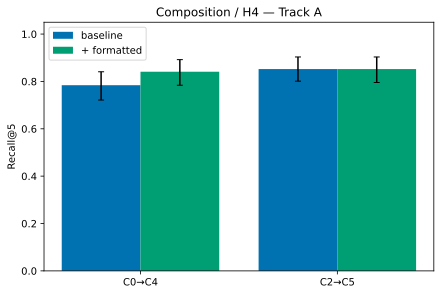
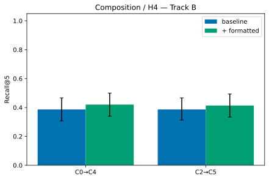

# RAG Semantic Formatter — Results

**Run:** `run-20260724-135411` · **UTC:** 2026-07-24T13:54:11Z · **config digest:** `08e7615fdfb0…`

## TL;DR verdict

**Decision: PARTIAL** — H1 not, H2 supported, H3 supported, H4 not.

> 2 track(s) evaluated; VALIDATE per §2.4 needs C3>=C2 on >=2 tracks + H2 + H3. validate_tracks=1, complement_tracks=0. A: C3=0.818 vs C2=0.852 (Δ=-0.034) — significantly beats semantic(C1) — H4 not significant (C5 vs C2 Δ=0.0)  | B: C3=0.387 vs C2=0.387 (Δ=+0.000) — significantly beats neither C0 nor C1 — H4 not significant (C5 vs C2 Δ=0.0267) . Per changelog-8, 'beats' claims above are only those with a Holm-significant, CI-excludes-0 pairwise difference. H3 note: the subjective readability rubric floored out on synthetic prose (judge rated BOTH original and formatted poorly); the OBJECTIVE preserved-term check (0 failures) is the trustworthy H3 signal — confirm subjective readability on Track B real prose. 


## Setup

- Tracks: A, B; conditions: C0, C1, C2, C3, C4, C5, C3-noref, C3-nosize, C3-nodedup, C3-markeronly.
- Embedding: `all-MiniLM-L6-v2` (backend `sentence-transformers`, rev `main`); FAISS `1.14.3`; seed 1337.
- LLM: `claude-opus-4-8` (provider `anthropic`).
- Chosen chunk sizes (dev-swept, §5.3): {'C0': 768, 'C1': 512, 'C3': 768}.
- Track A: n_test=176 queries.
- Track B: n_test=150 queries.

## Headline — Track A (recall@k, hybrid, any-overlap; 95% CI at k=5)

| Condition | R@1 | R@3 | R@5 [CI] | R@10 | nDCG@5 | MRR | units | u/doc |
|---|---|---|---|---|---|---|---|---|
| C0 | 0.597 | 0.739 | 0.784 [0.722,0.841] | 0.835 | 0.694 | 0.675 | 90 | 2.0 |
| C1 | 0.244 | 0.455 | 0.540 [0.466,0.614] | 0.602 | 0.400 | 0.365 | 354 | 7.9 |
| C2 | 0.523 | 0.801 | 0.852 [0.801,0.903] | 0.875 | 0.706 | 0.661 | 90 | 2.0 |
| C3 | 0.585 | 0.756 | 0.818 [0.761,0.875] | 0.875 | 0.709 | 0.679 | 90 | 2.0 |
| C4 | 0.750 | 0.812 | 0.841 [0.784,0.892] | 0.909 | 0.788 | 0.791 | 90 | 2.0 |
| C5 | 0.580 | 0.818 | 0.852 [0.795,0.903] | 0.869 | 0.736 | 0.699 | 90 | 2.0 |
| C3-noref | 0.602 | 0.722 | 0.778 [0.716,0.841] | 0.835 | 0.695 | 0.674 | 90 | 2.0 |
| C3-nosize | 0.358 | 0.614 | 0.699 [0.631,0.767] | 0.761 | 0.551 | 0.503 | 1552 | 34.5 |
| C3-nodedup | 0.574 | 0.790 | 0.830 [0.773,0.881] | 0.881 | 0.716 | 0.684 | 90 | 2.0 |
| C3-markeronly | 0.585 | 0.744 | 0.795 [0.733,0.852] | 0.852 | 0.698 | 0.675 | 90 | 2.0 |


### Significance (paired bootstrap + permutation, Holm) — Track A

| Pair | Δrecall@5 | 95% CI | p | p(Holm) | CI excludes 0 |
|---|---|---|---|---|---|
| C3_vs_C2 | -0.034 | [-0.074,+0.006] | 0.1783 | 0.7131 | no |
| C3_vs_C1 | +0.278 | [+0.199,+0.358] | 0.0001 | 0.0006 | yes |
| C3_vs_C0 | +0.034 | [-0.011,+0.080] | 0.2360 | 0.7131 | no |
| C5_vs_C2 | +0.000 | [-0.034,+0.034] | 1.0000 | 1.0000 | no |
| C4_vs_C0 | +0.057 | [+0.017,+0.102] | 0.0205 | 0.1025 | yes |
| C5_vs_C3 | +0.034 | [-0.011,+0.080] | 0.2091 | 0.7131 | no |

### Composition / complementarity (H4) — Track A

- C4 (formatted+naive) 0.841 vs C0 (naive) 0.784.
- C5 (formatted+contextual) 0.852 vs C2 (contextual) 0.852 — the H4 test.




**Common-size control (naive @256, §5.2):** original corpus 0.568 vs formatted corpus 0.722 (Δ=+0.153) — isolates text-quality from unit-count. See `figures/common_size_control_A.csv`.


## Headline — Track B (recall@k, hybrid, any-overlap; 95% CI at k=5)

| Condition | R@1 | R@3 | R@5 [CI] | R@10 | nDCG@5 | MRR | units | u/doc |
|---|---|---|---|---|---|---|---|---|
| C0 | 0.147 | 0.333 | 0.387 [0.307,0.467] | 0.407 | 0.281 | 0.248 | 378 | 6.3 |
| C1 | 0.147 | 0.293 | 0.367 [0.287,0.447] | 0.467 | 0.258 | 0.237 | 1019 | 17.0 |
| C2 | 0.147 | 0.307 | 0.387 [0.313,0.467] | 0.487 | 0.267 | 0.246 | 378 | 6.3 |
| C3 | 0.147 | 0.320 | 0.387 [0.307,0.467] | 0.453 | 0.274 | 0.246 | 381 | 6.3 |
| C4 | 0.160 | 0.327 | 0.420 [0.340,0.500] | 0.467 | 0.297 | 0.263 | 379 | 6.3 |
| C5 | 0.120 | 0.307 | 0.413 [0.333,0.493] | 0.513 | 0.272 | 0.239 | 381 | 6.3 |
| C3-noref | 0.173 | 0.333 | 0.380 [0.300,0.460] | 0.440 | 0.283 | 0.259 | 381 | 6.3 |
| C3-nosize | 0.147 | 0.220 | 0.253 [0.187,0.327] | 0.380 | 0.202 | 0.205 | 2542 | 42.4 |
| C3-nodedup | 0.153 | 0.333 | 0.380 [0.300,0.460] | 0.447 | 0.276 | 0.251 | 382 | 6.4 |
| C3-markeronly | 0.173 | 0.340 | 0.373 [0.293,0.453] | 0.440 | 0.280 | 0.259 | 381 | 6.3 |


### Significance (paired bootstrap + permutation, Holm) — Track B

| Pair | Δrecall@5 | 95% CI | p | p(Holm) | CI excludes 0 |
|---|---|---|---|---|---|
| C3_vs_C2 | +0.000 | [-0.047,+0.047] | 1.0000 | 1.0000 | no |
| C3_vs_C1 | +0.020 | [-0.053,+0.093] | 0.7200 | 1.0000 | no |
| C3_vs_C0 | +0.000 | [-0.047,+0.047] | 1.0000 | 1.0000 | no |
| C5_vs_C2 | +0.027 | [-0.027,+0.080] | 0.4486 | 1.0000 | no |
| C4_vs_C0 | +0.033 | [-0.007,+0.073] | 0.1787 | 1.0000 | no |
| C5_vs_C3 | +0.027 | [-0.020,+0.073] | 0.3937 | 1.0000 | no |

### Composition / complementarity (H4) — Track B

- C4 (formatted+naive) 0.420 vs C0 (naive) 0.387.
- C5 (formatted+contextual) 0.413 vs C2 (contextual) 0.387 — the H4 test.




**Common-size control (naive @256, §5.2):** original corpus 0.353 vs formatted corpus 0.380 (Δ=+0.027) — isolates text-quality from unit-count. See `figures/common_size_control_B.csv`.


## Guardrail — dense vs hybrid (H2)

Vocabulary drift would show as hybrid failing to track dense. See `figures/dense_vs_hybrid_<track>.svg`. Preserved-term failures: 0.


## Diagnostics (§8)

- **§8a C2-dense vs C0-dense (Track A):** dense C2=0.7045 vs C0=0.7045 (identical); hybrid C2=0.852 vs C0=0.784. The blurb barely moves DENSE ranking (blurb is small relative to a 768-token unit) but lifts HYBRID via BM25 — the gain is lexical, not semantic. Not a bug: the blurbed text is what gets embedded (see ContextualChunker), the dense delta is just negligible at this unit size.
- **§8b C1 semantic sanity (Track A):** 354 units, 7.9/doc, mean 155 tokens. See `results.md` diagnostics note / boundary dump in the run log.
- **§8c nosize floor (Track A):** with the ≥30-token unit floor, C3-nosize has 1552 units (was ~5,143 degenerate micro-units in v1.0); corrected right-sizing contribution Δrecall@5=+0.119.
- **§8a C2-dense vs C0-dense (Track B):** dense C2=0.3000 vs C0=0.2933 (differ); hybrid C2=0.387 vs C0=0.387. Blurbs moved dense ranking as expected.
- **§8b C1 semantic sanity (Track B):** 1019 units, 17.0/doc, mean 263 tokens. See `results.md` diagnostics note / boundary dump in the run log.
- **§8c nosize floor (Track B):** with the ≥30-token unit floor, C3-nosize has 2542 units (was ~5,143 degenerate micro-units in v1.0); corrected right-sizing contribution Δrecall@5=+0.133.

## Ablations (Δrecall@5 = C3 − ablation)

| Track | Operation | Δrecall@5 |
|---|---|---|
| A | reference_resolution | +0.040 |
| A | right_sizing | +0.119 |
| A | de_duplication | -0.011 |
| A | text_editing_vs_markers | +0.023 |
| B | reference_resolution | +0.007 |
| B | right_sizing | +0.133 |
| B | de_duplication | +0.007 |
| B | text_editing_vs_markers | +0.013 |

`text_editing_vs_markers` isolates the value of editing text over pure boundary markers (§9).


## Faithfulness

Rubric: LLM 1-5 grounding rubric, temp 0. By condition (0–1): C0=0.580, C1=0.495, C2=0.560, C3=0.600, C4=0.560, C5=0.645.


## Cost

LLM cost (global): {'llm_calls': 0, 'llm_tokens': 0, 'input_tokens': 0, 'output_tokens': 0, 'cache_hits': 905, 'est_usd': 0.0}. See `figures/cost_vs_recall.svg`.


## Readability (H3)

C3 mean 1.45 vs original 1.60 on 20 docs; preserved-term failures 0. Rubric: LLM 1-5 readability rubric, temp 0 + preserved-term check.


## Threats to validity

- **Track A is synthetic and adversarial by construction** — the injected damage (anaphora, duplication, split) is exactly what the formatter targets, so Track A shows *mechanism*, not field generalization. VALIDATE requires ≥2 tracks (§2.4).
- **Per-condition LLM cost attribution** is approximate; only C2/C3 are charged and the global tally is authoritative.
- **Formatter provenance is approximate** (edited units map to source sentence offsets); any/strict variants are both reported as a cross-check (§13).

## Reproduction

```bash
make setup
make test
python -m src.run --track A --provider none  # zero-cost
python -m src.run --track A --provider anthropic   # headline (needs ANTHROPIC_API_KEY)
python -m src.run --report-only
```

Pre-registration hash: `11177e411f758fb0…` (frozen before treatment metrics).
